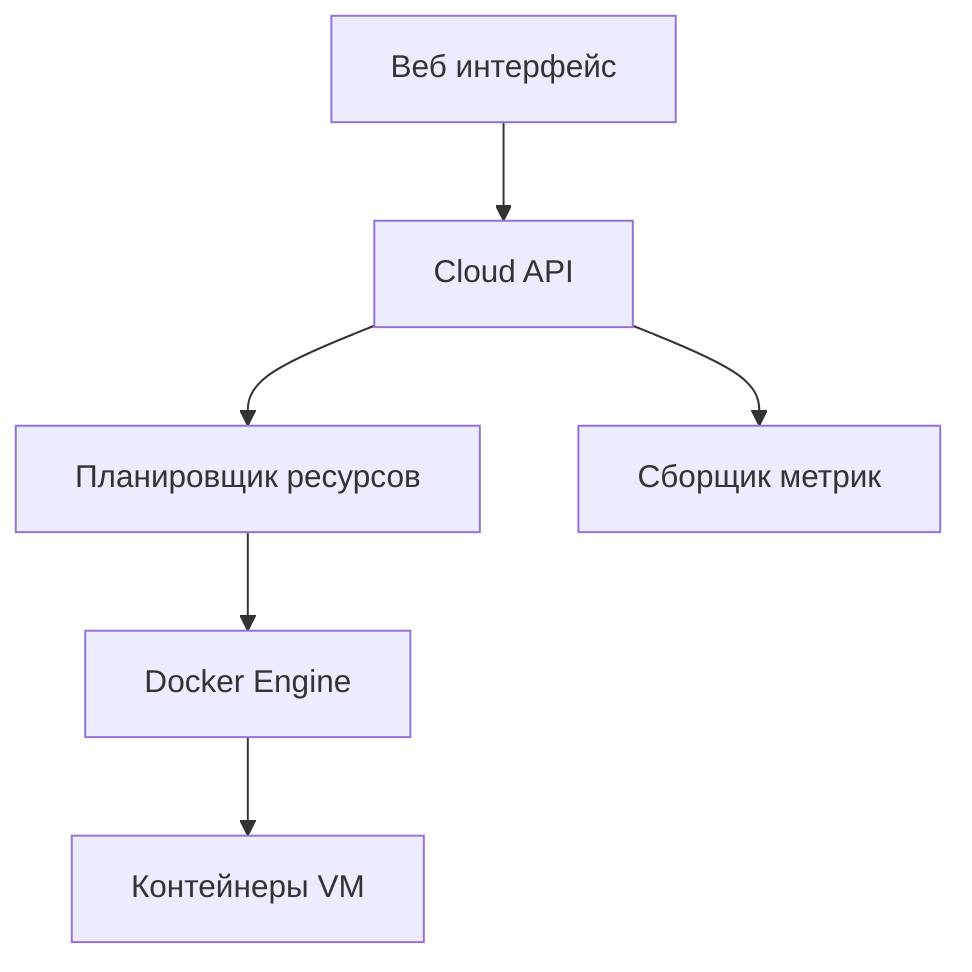

# Cloud IaaS Platform

Прототип облачной платформы **Infrastructure as a Service (IaaS)**, разработанный на **Node.js**, использующий **Docker** для запуска виртуальных машин и **Prisma ORM** для работы с базой данных.

Система позволяет создавать виртуальные машины, распределять ресурсы между клиентами и отслеживать нагрузку в реальном времени.

---

## Основные возможности

* Мультитенантная архитектура
* Управление жизненным циклом виртуальных машин
* Планировщик распределения VM по серверам
* Ограничения ресурсов для клиентов (CPU / RAM / Disk quotas)
* Использование Docker как слоя виртуализации
* Мониторинг нагрузки VM в реальном времени
* Статистика по всему кластеру

---

## Архитектура системы


Основные сущности системы
Tenant
Tenant — это клиент облака (компания или пользователь), которому выделяются ресурсы.

Пример:

```json
{
    "name": "Tenant A",
    "cpuQuota": 16,
    "ramQuota": 32,
    "diskQuota": 100
}
```
Квоты ограничивают максимальное количество ресурсов, которые может использовать клиент.

Compute Node
Compute Node — это физический сервер, на котором запускаются виртуальные машины.

Пример:

```json
{
    "name": "node-1",
    "cpuTotal": 16,
    "ramTotal": 32
}
```
Virtual Machine (VM)
VM — это виртуальный сервер. В данной системе VM реализована как Docker контейнер.

Пример:

```json
{
    "name": "vm-1",
    "cpu": 2,
    "ram": 2,
    "disk": 10,
    "tenantId": 1
}
```
Структура проекта
```text
src/
├── server.js
├── docker.js
├── prisma.js
├── ws.js
├── routes/
│   ├── tenants.js
│   ├── nodes.js
│   ├── vms.js
│   ├── metrics.js
│   └── cluster.js
├── services/
│   ├── schedulerService.js
│   ├── vmService.js
│   ├── metricsCollector.js
│   └── clusterService.js
└── prisma/
    └── schema.prisma
```
Установка и запуск
Установить зависимости
```bash
npm install
```
Запустить сервер
```bash
npm run dev
```
или

```bash
node src/server.js
```
Сервер будет доступен по адресу:

```text
http://localhost:3000
```
Основные API
Проверка сервера
```text
GET /
```
Ответ:

```text
Cloud IaaS API running
```
Работа с Tenant
Получить список клиентов
```text
GET /tenants
```
Создать клиента
```text
POST /tenants
```
```json
{
    "name": "Tenant A",
    "cpuQuota": 16,
    "ramQuota": 32,
    "diskQuota": 100
}
```
Работа с Compute Nodes
Получить список серверов
```text
GET /nodes
```
Создать сервер
```text
POST /nodes
```
```json
{
    "name": "node-1",
    "cpuTotal": 16,
    "ramTotal": 32
}
```
Работа с VM
Получить список VM
```text
GET /vms
```
Создать VM
```text
POST /vms
```
```json
{
    "name": "vm-1",
    "cpu": 2,
    "ram": 2,
    "disk": 10,
    "tenantId": 1
}
```
При создании VM система:

Проверяет квоты tenant

Выбирает compute node с доступными ресурсами

Создаёт Docker контейнер

Сохраняет VM в базе данных

Остановить VM
```text
POST /vms/:id/stop
```
Запустить VM
```text
POST /vms/:id/start
```
Удалить VM
```text
DELETE /vms/:id
```
Метрики VM
Получить статистику виртуальной машины:

```text
GET /metrics/vm/:id
```
Ответ:

```json
{
    "vmId": 1,
    "cpu": "3.25",
    "ram": "128.00"
}
```
Метрики получаются через Docker API.

Мониторинг в реальном времени
Система отправляет метрики VM через WebSocket.

Подключение:

```javascript
const ws = new WebSocket("ws://localhost:3000")

ws.onmessage = e => {
    console.log(JSON.parse(e.data))
}
```
Метрики отправляются каждую секунду.

Статистика кластера
Получить общую статистику инфраструктуры:

```text
GET /cluster/stats
```
Ответ:

```json
{
    "nodes": 2,
    "vms": 3,
    "cpu": {
        "total": 32,
        "used": 10
    },
    "ram": {
        "total": 64,
        "used": 20
    }
}
```
Генерация нагрузки (для тестирования)
Можно зайти в контейнер:

```bash
docker exec -it vm-1 sh
```
Запустить нагрузку на CPU:

```bash
while true; do :; done
```
После этого метрики CPU начнут расти.

Для генерации данных в базе данных:
```bash
npm run seed
```


Используемые технологии
```
Node.js

Express

Prisma ORM

SQLite

Docker

WebSocket
```

Что реализовано в системе
Проект реализует ключевые принципы облачной инфраструктуры:

мультитенантность

логическая изоляция клиентов

распределение ресурсов

контроль квот

мониторинг нагрузки

управление жизненным циклом виртуальных машин
